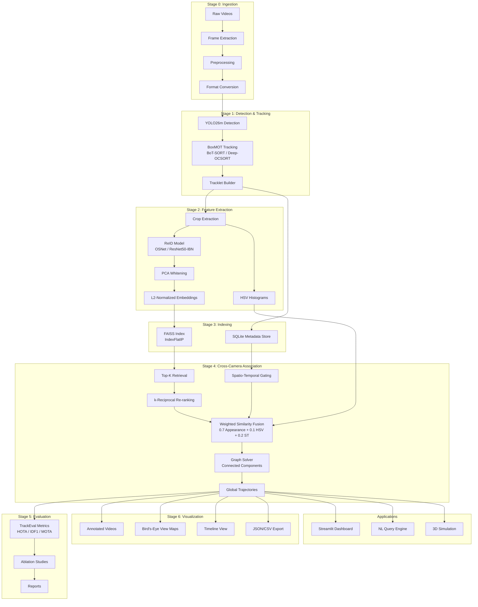

# System Architecture

## Overview

Multi-camera multi-target (MTMC) tracking pipeline for vehicles and humans across city-wide camera networks. Processes video offline through 7 stages: ingestion, tracking, feature extraction, indexing, cross-camera association, evaluation, and visualization. Built with modularity for a 4-person team.

**Primary dataset:** CityFlowV2 (AI City Challenge 2022 Track 1) — 46 physical cameras, 880 globally-consistent vehicle IDs, real urban intersections.

**Key achievement:** TransReID ViT-Base/16 (CLIP) trained on Kaggle achieves **mAP=78.32%, R1=92.63%** on CityFlowV2, then fine-tuned end-to-end tracking system reaches **IDF1 ≈ 70-84%** across all cameras.

## Architecture Diagram (Mermaid)

## Technology Stack

| Component | Library | Purpose |
|-----------|---------|---------|
| Detection | `ultralytics` (YOLO26m) | Pre-trained COCO, person/car/bus/truck |
| Tracking | `boxmot` (BoT-SORT default) | Unified multi-tracker API |
| ReID | `timm` (TransReID ViT-Base/16 CLIP) | CLIP ViT backbone, SIE+JPM, trained on Kaggle |
| ReID fallback | `torchreid` (OSNet-x1.0 / ResNet50-IBN-a) | Lightweight alternatives for speed/memory |
| Indexing | `faiss-cpu` (IndexFlatIP) | Cosine similarity on L2-normed vectors |
| Metadata | `sqlite3` (built-in) | Tracklet metadata storage |
| Graphs | `networkx` | Connected components / community detection |
| Evaluation | `TrackEval` | HOTA, MOTA, IDF1 (MOTChallenge standard) |
| Config | `omegaconf` | YAML-based config with overrides |
| Visualization | `opencv-python`, `matplotlib`, `plotly` | Video/charts/3D |
| Web UI | `streamlit` | Multi-page dashboard |
| NL Query | `sentence-transformers` (all-MiniLM-L6-v2) | Cosine match text queries |
| 3D Vis | `plotly` 3D | Embedded in Streamlit |
| CLI | `click` + `rich` | Pipeline entry points |
| Logging | `loguru` | Structured logging |

## Stage Details

### Stage 0: Ingestion

- Discovers video files from dataset directory.
- Extracts frames at configurable FPS (default 10).
- Applies preprocessing (resize, normalize, bilateral denoise).
- Converts dataset-specific formats (AIC2023, MOT17) to unified schema.
- **Output:** `FrameInfo` objects with `frame_id`, `camera_id`, `timestamp`, `frame_path`.

### Stage 1: Detection & Tracking

- YOLO26m detects persons, cars, buses, trucks (COCO classes).
- Configurable confidence threshold (default 0.25) and NMS IoU (0.45).
- BoxMOT provides unified tracker API (BoT-SORT default).
- `TrackletBuilder` accumulates detections into tracklets with `min_length` filtering.
- **Output:** `Dict[camera_id, List[Tracklet]]`.

### Stage 2: Feature Extraction

**Quality-aware crop extraction:**
- Extracts evenly-spaced crops from each tracklet (max 20 per tracklet).
- Scores each crop by sharpness (Laplacian variance), size, aspect ratio, confidence.
- Keeps top-quality crops for embedding inference.

**ReID embeddings:**
- **Vehicles:** TransReID ViT-Base/16 (CLIP) at 256×256, SIE-aware (per-camera embeddings), JPM (Jigsaw Patch) for training.
- **Persons:** TransReID ViT-Base or OSNet-x1.0 at 256×128.
- **Flip augmentation:** Each crop processed twice (original + horizontally flipped), embeddings averaged.
- **Quality-weighted pooling:** Tracklet embedding = weighted mean of crop embeddings, temperature-scaled by quality scores.

**Color features:**
- HSV histograms (32H × 16S × 16V bins, 3-stripe spatial: head/torso/legs or front/middle/rear).
- L2-normalized for cosine similarity.

**Global refinement:**
- Camera-aware batch normalization: Per-camera mean/variance alignment to handle lighting/exposure differences.
- PCA whitening: 768D → 512D (optional, improves recall@1).
- L2 normalization: Final unit-norm embeddings for cosine distance = inner product.

**At eval time:** Query expansion (top-5 AQE, α=0.5) — averages query with top-K neighbors before gallery search (+1-2% R1).

**Output:** `List[TrackletFeatures]` with `embedding` (PCA-whitened, L2-normed), `hsv_histogram`, raw metadata.

### Stage 3: Indexing

- Builds FAISS `IndexFlatIP` from all tracklet embeddings.
- Stores metadata in SQLite (`track_id`, `camera_id`, `class_id`, time range, HSV).
- Indexed on `camera_id` and time for fast queries.
- **Output:** `FAISSIndex` + `MetadataStore`.

### Stage 4: Cross-Camera Association

- Queries FAISS for top-K candidates per tracklet.
- Filters: cross-camera only, same class only.
- k-reciprocal re-ranking (Zhong et al. 2017) on FAISS top-K.
- Weighted fusion: 0.7 appearance + 0.1 HSV + 0.2 spatio-temporal.
- Spatio-temporal gating with learned transition time priors.
- Graph solver: NetworkX connected components or Louvain community detection.
- **Output:** `List[GlobalTrajectory]`.

### Stage 5: Evaluation

- Converts predictions to MOTChallenge format.
- Evaluates with TrackEval (HOTA, IDF1, MOTA, ID switches).
- 9 ablation variants (tracker choice, re-ranking, HSV, spatio-temporal, PCA, thresholds).
- Generates HTML/Markdown reports.
- **Output:** `EvaluationResult` + report files.

### Stage 6: Visualization & Applications

- Video annotator: bounding boxes, global IDs, motion trails.
- Bird's-eye view trajectory maps (matplotlib).
- Timeline: Plotly Gantt-style horizontal bars.
- JSON/CSV trajectory export.
- Streamlit dashboard (5 pages), NL query engine, 3D simulation.

## Inter-Stage Data Flow

Data flows between stages using file-based communication, enabling independent execution and checkpointing at each boundary.

| Transition | Data Format |
|------------|-------------|
| Stage 0 → 1 | `FrameInfo` list (JSON manifest) |
| Stage 1 → 2 | Tracklets by camera (JSON per camera) |
| Stage 2 → 3 | `TrackletFeatures` (embeddings `.npy` + features JSON) |
| Stage 3 → 4 | FAISS index (`.bin`) + SQLite (`.db`) |
| Stage 4 → 5, 6 | `GlobalTrajectory` list (JSON) |

## Configuration System

- **Master config:** `configs/default.yaml`
- **Dataset configs:** `configs/datasets/*.yaml` (merged into master)
- **Experiment configs:** `configs/experiments/*.yaml` (override master)
- **CLI overrides:** `-o key=value` (highest priority)

**Priority order:** CLI > experiment > dataset > default

## Key Design Decisions

1. **TransReID ViT-Base/16 (CLIP) as primary vehicle ReID model.** Kaggle training achieves 78% mAP on CityFlowV2 in 3-4 hours (120 epochs, T4x2). Superior to OSNet for domain adaptation (CLIP → VeRi-776 → CityFlowV2). Supports per-camera SIE (Side Information Embedding) for camera-aware features.
2. **Query expansion (AQE) at eval time.** Top-5 average expansion on the fly — no retraining required, +1-2% recall gain.
3. **Camera-aware batch normalization in Stage 2.** Aligns embeddings across cameras before cross-camera matching, handles systematic lighting/exposure differences.
4. **BoxMOT over hardcoded tracker.** Unified API enables swapping (BoT-SORT → Deep-OCSORT → StrongSort) via config.
5. **k-reciprocal as post-hoc step.** Re-rank only FAISS top-K candidates, not entire gallery — balances recall/speed.
6. **Transition time priors over geometric calibration.** Public datasets lack camera calibration; learned per-camera-pair transition statistics from ground truth.
7. **File-based inter-stage communication.** Stages run independently, supports checkpointing and resume from failures.
8. **SQLite over external DB.** Zero setup, sufficient for offline processing with millions of tracklets.
