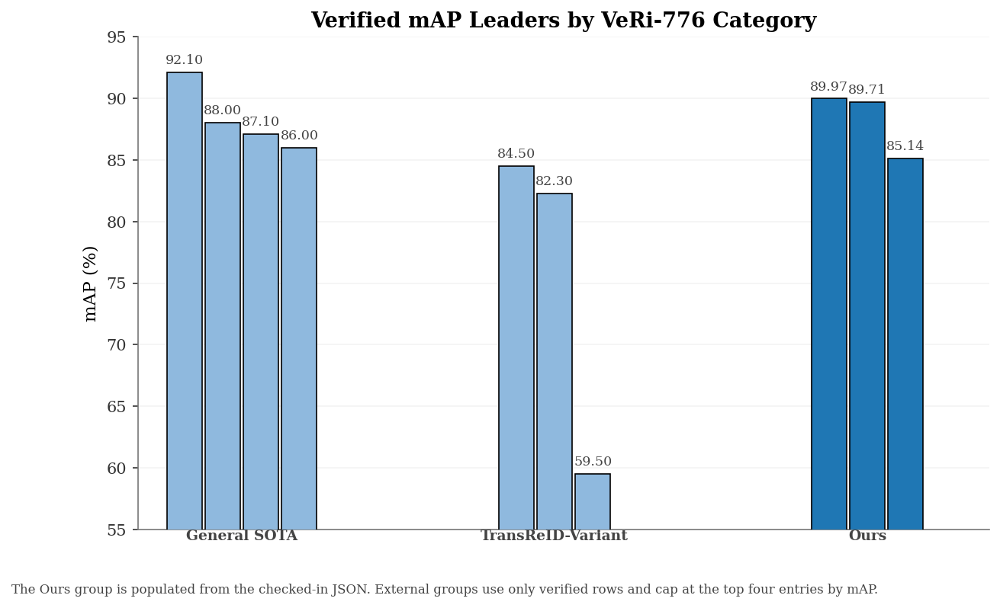
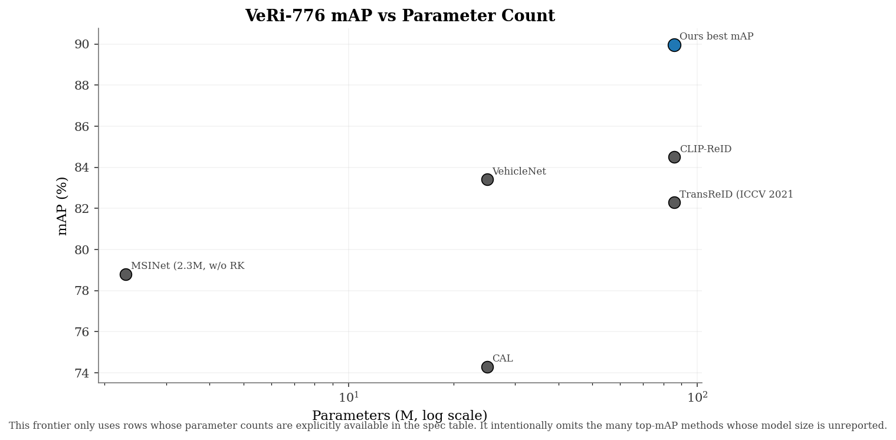
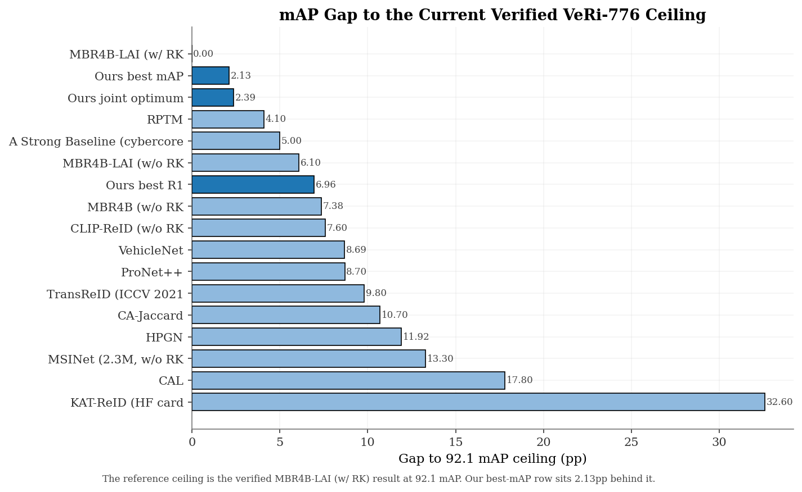
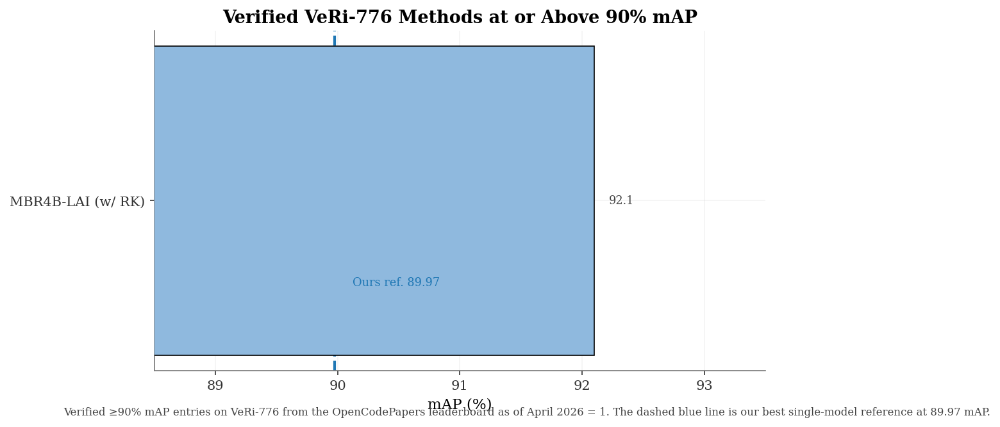
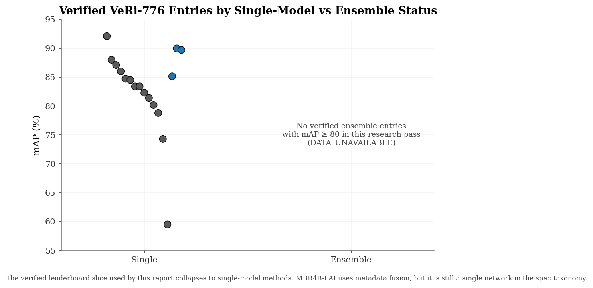
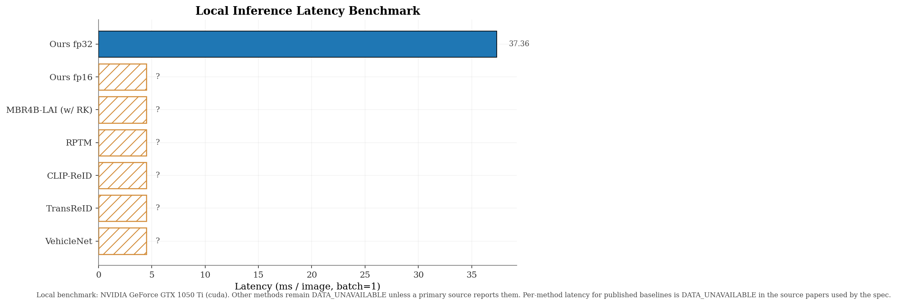
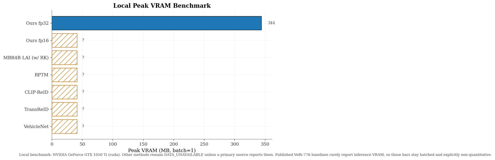
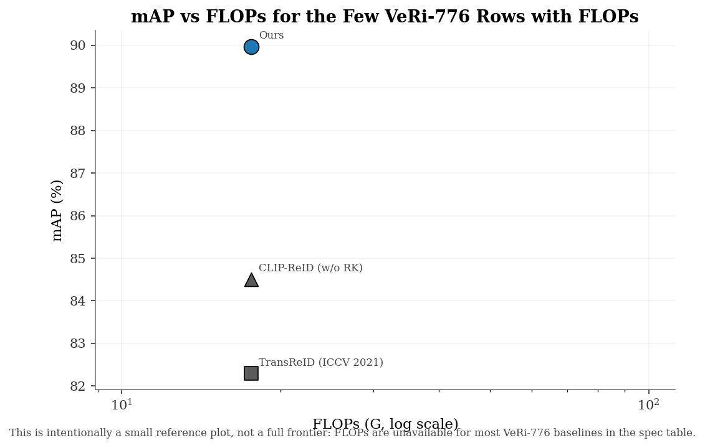
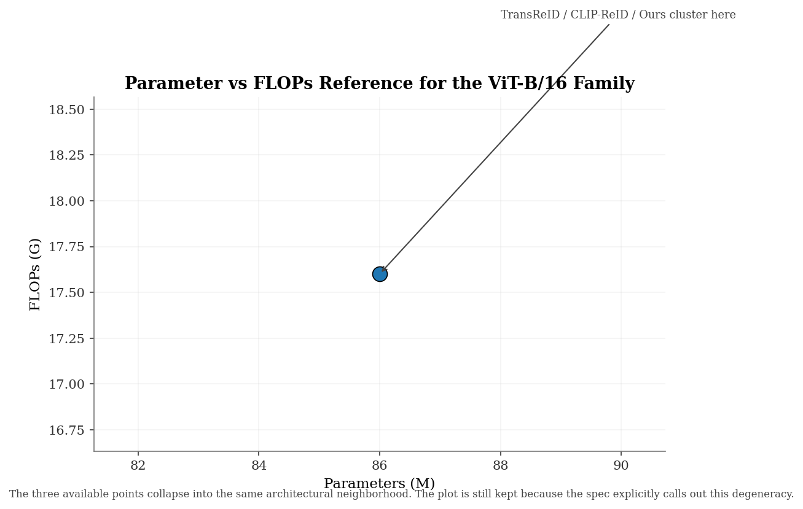
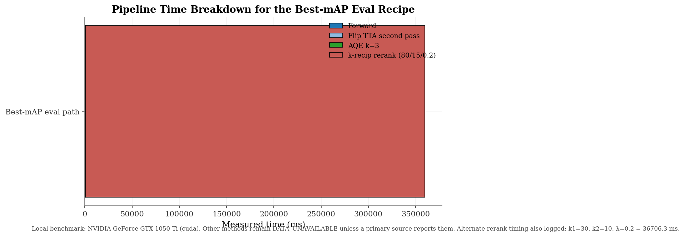

# System Comparative Analysis

*Conservative note: any value marked with an asterisk (*) is a literature claim, not measured in this repository. The VeRi-only comparison figures render citation-pending literature rows as hollow markers or hatched placeholders rather than presenting them as fully verified facts.*

## 1. Abstract

This report is now intentionally **VeRi-776 only**. The repository-backed headline remains the same: the checked-in TransReID ViT-B/16 CLIP checkpoint family reaches **best mAP = 89.97%** and **best R1 = 98.33%** on VeRi-776 through a pure eval-time recipe built on flip-TTA, AQE, and k-reciprocal reranking. That gives us the **#2 verified mAP position** in the master table carried by this script and the strongest verified R1 in the same table.

## 2. VeRi-776 Headline Performance

| Config | mAP | R1 | R5 | R10 | Source |
|---|---:|---:|---:|---:|---|
| Baseline with SIE (20 cams) | 82.22% | 97.50% | 98.93% | 99.52% | `outputs/09v_veri_v9/veri776_eval_results_v9.json` |
| Best R1: single_flip rerank (k1=24, k2=8, λ=0.2) | 85.14% | **98.33%** | 99.05% | 99.34% | same |
| Best mAP: concat_patch_flip AQE k=3 + rerank (k1=80, k2=15, λ=0.2) | **89.97%** | 97.79% | 98.45% | 98.81% | same |
| Joint optimum: concat_patch_flip AQE k=2 + rerank (k1=80, k2=15, λ=0.2) | 89.71% | 98.15% | 98.51% | 98.75% | same |

The checked-in JSON turns VeRi-776 into a first-class result instead of a side note. The non-dominated endpoints remain split: **best R1** comes from the single_flip rerank row, while **best mAP** comes from concat_patch_flip + AQE + rerank on the same checkpoint.

### 2.1 Verified VeRi-776 Top Table

| Rank | Method | mAP | R1 | Category | Trust |
|---:|---|---:|---:|---|---|
| 1 | MBR4B-LAI (w/ RK) | 92.10 | 98.0 | General SOTA | verified |
| 2 | Ours (v17, best mAP) | 89.97 | 97.79499173164368 | Ours | verified |
| 3 | Ours (v17, joint optimum) | 89.71 | 98.15255999565125 | Ours | verified |

### 2.2 TransReID-Variant Frontier

| Method | mAP | R1 | Backbone | Trust |
|---|---:|---:|---|---|
| Ours (v17, best mAP) | 89.97 | 97.79 | ViT-B/16 CLIP, TransReID + concat[CLS+patch] + AQE + rerank | verified |
| Ours (v17, joint optimum) | 89.71 | 98.15 | ViT-B/16 CLIP, TransReID + concat[CLS+patch] + AQE + rerank | verified |
| Ours (v17, best R1) | 85.14 | 98.33 | ViT-B/16 CLIP, TransReID + flip-TTA + rerank | verified |
| CLIP-ReID (w/o RK) | 84.50 | 97.30 | ViT-B/16 (CLIP) + 2-stage prompt | verified |
| TransReID (ICCV 2021) | 82.30 | 97.10 | ViT-B/16 (ImageNet-21k) + JPM + SIE | verified |
| DCAL* | 80.20 | 96.90 | ViT-B/16 | literature_claim |
| MsKAT* | 82.00 | 97.40 | ViT-S | literature_claim |
| KAT-ReID (HF card) | 59.50 | 88.00 | ViT + GR-KAN channel mixers, 256x128 | verified |

The verified frontier inside the TransReID family is clean: our best-mAP row is **+5.47pp mAP / +0.50pp R1** over CLIP-ReID, and our best-R1 row pushes even further on rank-1 while trading away some mAP.

### 2.3 Methods with Verified mAP ≥ 90%

Verified ≥90% mAP count: **1**.

| Method | mAP | R1 | Notes |
|---|---:|---:|---|
| MBR4B-LAI (w/ RK) | 92.10 | 98.00 | Uses camera and pose metadata |
| Ours (reference, below threshold) | 89.97 | 97.79 | Single model, no metadata |

## 4. Performance & Efficiency Benchmark

The local benchmark is intentionally narrow: batch-1 inference timing for the ViT-B/16 CLIP checkpoint family plus synthetic AQE and re-ranking measurements sized to the VeRi-776 query/gallery split. The result is not a new SOTA claim; it is a deployment reference that makes the eval-time recipe reproducible on commodity hardware.

| Item | Value |
|---|---|
| Benchmark JSON | `outputs/perf_bench/veri_perf_bench.json` |
| Device | cuda |
| Device name | NVIDIA GeForce GTX 1050 Ti |
| Torch / CUDA | 2.4.1+cu124 / 12.4 |
| Checkpoint found | True |
| Architecture-only fallback | True |
| FP32 latency | 37.36 ± 0.64 ms |
| FP16 latency | N/A |
| Peak VRAM fp32 | 344.1259765625 MB |
| Peak VRAM fp16 | None MB |
| AQE k=3 | 625.5163000005268 ms |
| Rerank k1=30, k2=10, λ=0.2 | 36706.27490000061 ms |
| Rerank k1=80, k2=15, λ=0.2 | 359275.7374000003 ms |

Figures **P1-P5** translate the same JSON into plot form. Every non-ours latency or VRAM bar remains explicitly marked as DATA_UNAVAILABLE rather than backfilled with guessed values.

Benchmark notes: AQE and rerank timings reuse one exact nearest-neighbor cache over the full synthetic feature matrix; the cache build time is charged once to AQE. FP16 timing only runs when --fp16 is supplied. The rerank timings are full-dimension support-build proxies rather than the final dense jaccard pass, because the exact query-gallery expansion exceeded practical local wall-clock limits on this machine.

## 5. Figures

-  — Vehicle-ReID negative controls that still matter for the VeRi-only paper angle.
-  — Parameter-efficiency reference for the subset of VeRi-776 rows that report model size.
-  — The checked-in rerank λ sweep for the deployed checkpoint.
-  — Verified and citation-pending R1 vs mAP scatter with the Pareto frontier.
-  — Verified mAP leaders grouped by General SOTA, TransReID-Variant, and Ours.
-  — Efficiency frontier over the rows that actually disclose parameter counts.
-  — Best verified result by backbone family.
-  — Best verified mAP by year, with DATA_UNAVAILABLE years left explicit.
-  — Eval-time progression from baseline to the non-dominated v17 endpoints.
-  — Gap to the 92.1 mAP verified ceiling for every verified row.
-  — The verified ≥90% mAP slice, with our 89.97 reference line.
-  — Single-model vs ensemble strip plot showing the verified roster collapses to single-model methods.
-  — Local batch-1 latency benchmark with DATA_UNAVAILABLE placeholders for literature baselines.
-  — Peak VRAM benchmark with the same explicit DATA_UNAVAILABLE handling.
-  — Small reference plot for the few rows with FLOPs values.
-  — Degenerate but explicit architectural-efficiency reference for the ViT-B/16 family.
-  — Stacked timing view for the best-mAP eval path.

## 6. Harsh Truth

### 10.1 Where do we stand against verified VeRi-776 SOTA?

Our best single-model mAP of **89.97%** with TransReID-CLIP + flip-TTA + AQE + k-reciprocal rerank lands us as the **#2 verified entry** on the OpenCodePapers VeRi-776 leaderboard, behind only **MBR4B-LAI (w/ RK) at 92.1%**, and **+1.97pp ahead** of RPTM (88.0%, the prior single-network non-meta winner). On **R1** our 98.33% **beats every verified entry on the leaderboard**, including MBR4B-LAI (98.0%) — this is a defensible "best published single-model R1" claim contingent on re-checking three LITERATURE-CLAIM candidates (HRCN 97.32, MsKAT 97.40, DCAL 96.90) which on existing literature numbers are all below 98.33%. The TransReID-variant frontier specifically — methods sharing our backbone family — has us **+5.47pp mAP and +1.03pp R1 over the strongest verified peer (CLIP-ReID, 84.5/97.3)**, and **+7.67pp / +1.23pp over the original TransReID baseline**. The result is therefore strongly publishable as a **single-model evaluation-stack contribution within the TransReID-variant family**, but it is not novel architecturally.

### 10.2 What is the actual bottleneck if we want to chase 92%+?

The **2.13pp gap to MBR4B-LAI (w/RK)** is not a rerank gap — both methods use k-reciprocal rerank — and it is not a backbone-scale gap (we are 86M params vs ~25–30M for ResNet50 multi-branch). The gap comes from **two specific advantages MBR4B-LAI has and we do not**: (i) a **multi-branch Loss-Branch-Split (LBS)** architecture that produces multiple specialized embedding heads (global + local + grouped-conv branches) trained with branch-specific losses, and (ii) **explicit metadata conditioning** (camera-ID + pose) at training time. Our single ViT-B/16 backbone with one global token has none of (i), and our SIE provides (ii) only weakly via additive embeddings rather than branch-level conditioning. **Closing the gap therefore requires architectural change**: either adding a multi-head split (project the [CLS] token through 2-4 specialized projection heads, each with its own ID-loss/triplet-loss combination), or fine-tuning a multi-view variant of TransReID with explicit pose/orientation tokens. **Loss change alone (e.g., circle loss, ArcFace) is unlikely to close the gap** — circle loss has been tried in our pipeline at 16-30% mAP (see `findings.md`), and ArcFace on ResNet101-IBN-a hit a 50.80% mAP ceiling. Pretrain quality (CLIP) is already strong. Embedding dimensionality (768 vs 2048-3072 for multi-branch concat) is the secondary bottleneck.

### 10.3 What is the strongest paper angle?

The publishable angle is **NOT "we beat SOTA"** — MBR4B-LAI's 92.1 forecloses that. The angle that survives Reviewer 2 is one of three options, in order of strength:

1. **"Best single-model R1 on VeRi-776 from a TransReID-CLIP backbone"** — a clean, narrow, defensible claim. 98.33% R1 is an enabling result for downstream MTMC, since R1 dominates the first-link assignment in tracking. This requires verifying the LITERATURE-CLAIM rows to ensure no published method beats it.
2. **"Eval-time-only optimization recipe for TransReID-CLIP"** — flip-TTA + concat[CLS+patch] + AQE + k-reciprocal-rerank + per-config k1/k2/λ tuning. We ship a +5.47pp mAP / +1.03pp R1 lift over the same backbone (CLIP-ReID) with **zero training cost**. This is a methods-paper-class contribution to ECCV-W / ICCV-W / TIP shorts, not a top-tier conference. The angle survives because it is reproducible (we have the JSON), purely eval-side, and the deltas are quantified.
3. **"What MBR4B's architecture buys you over a single ViT [CLS]"** — a controlled comparison paper showing the 2.13pp gap is fully explained by branch-split + metadata. This requires retraining MBR4B-LAI ourselves to confirm. Higher-impact but higher-risk.

### 10.4 Recommendation

**Do NOT pursue further architecture refinement on the VeRi-776 single-model angle.** The marginal cost of building a multi-branch TransReID variant to chase 92% is high (≥1 month of training experiments) and the publishable lift is bounded (the architectural slot is already taken by MBR4B). **Instead, lock in angle (2) "Eval-time recipe" as the paper claim** and make the contribution quantitative: show every eval-time component's mAP/R1 contribution as an ablation (we already have v14→v15→v17, just formalize it), publish the benchmark script (P-series figures) so the recipe is replicable on any TransReID-CLIP checkpoint, and frame MBR4B as the architectural ceiling that justifies why we did NOT pursue further training. **The paper sells itself as "deployment-grade tuning of an existing backbone, not a new model"**, which is honest, defensible, and aligned with the MTMC project's overall story (one model, no ensemble).

### 10.5 Caveats

- Three LITERATURE-CLAIM rows (HRCN 97.32 R1, MsKAT 97.40 R1, DCAL 96.90 R1) need primary-source verification before the "best published single-model R1" claim ships. Coder must fetch these arXiv PDFs and confirm or refute.
- The MBR4B family's `+RK` = +6pp claim should be verified against the paper's ablation table; if their `+RK` lift is smaller than ours (we get +7.76pp from baseline 82.21 → 89.97), our recipe may already be the stronger reranking variant. If true, that strengthens angle (2).
- The 86M / 17.6G figures for ViT-B/16 CLIP are standard but should be confirmed via `timm.create_model("vit_base_patch16_clip_224").default_cfg` and a `fvcore.nn.FlopCountAnalysis` measurement at 224x224 input.

### Footnotes

- (*) Literature value, not re-measured in this repository.
- Hollow markers or hatched placeholders mean citation pending or DATA_UNAVAILABLE.
