# System Comparative Analysis

*Conservative note: any value marked with an asterisk (*) is a literature claim, not measured in this repository. The new VeRi-776 comparison figures render citation-pending literature rows as hollow markers or hatched white bars rather than presenting them as fully verified.*

## 1. Abstract

This document compares the MTMC Tracker system against published references on CityFlowV2, VeRi-776, and WILDTRACK. The headline CityFlowV2 result remains unchanged: a single **TransReID ViT-B/16 CLIP** backbone, augmented at association time with a **complementary score-fusion stream**, reaches **MTMC IDF1 = 0.7703** on CityFlowV2, which is **90.77%** of the AIC22 1st-place result (**0.8486**) while using one primary ReID model instead of a multi-model leaderboard ensemble. On VeRi-776, the same family of weights now has a fully reproducible single-model comparison bundle centered on **Best R1 = 98.33%** and **Best mAP = 89.97%** from the checked-in v17 sweep.

## 2. Headline Performance

### 2.1 Vehicle Pipeline (CityFlowV2)

| Metric | Value | Source |
|---|---:|---|
| MTMC IDF1 (best, fusion) | **0.7703** | `findings.md` final result; `experiment-log.md` header |
| MTMC IDF1 (no-fusion control, single CLIP) | **0.7663** | `findings.md` no-fusion control |
| MTMC IDF1 (secondary fusion-stream standalone control) | **0.744** | `findings.md` current performance |
| Single-camera ReID mAP (TransReID ViT-B/16 CLIP @ 256px) | **80.14%** | `findings.md`; `.github/copilot-instructions.md` |
| Single-camera ReID R1 (TransReID ViT-B/16 CLIP @ 256px) | **92.27%** | same |
| Single-camera ReID mAP (secondary fusion stream) | **86.79%** | `findings.md` current performance |
| Single-camera ReID R1 (secondary fusion stream) | **96.15%** | same |
| Secondary ResNet101-IBN-a mAP | **52.77%** | `findings.md`; `.github/copilot-instructions.md` |

The deployed fusion operating point is still **10c v15 / 10a v7** with `w_secondary=0.00` and `w_tertiary=0.60`. Relative to the single-CLIP control, the complementary fusion stream adds **+0.40pp** MTMC IDF1. The same DINOv2 stream on its own still regresses to **0.744**, which keeps the underlying conclusion intact: stronger single-camera discrimination does not automatically translate to stronger cross-camera MTMC.

### 2.2 Person Pipeline (WILDTRACK)

| Metric | Value | Source |
|---|---:|---|
| Ground-plane IDF1 | **0.947** | `findings.md`; `.github/copilot-instructions.md` |
| Ground-plane MODA | **0.903** | `.github/copilot-instructions.md` |
| Detector MODA (MVDeTr ResNet18, 12a v3) | **0.921** | `findings.md` |
| Tracker configs tested | **59+** | `findings.md` |
| Status | **FULLY CONVERGED** | same |

## 3. Per-Dataset Comparison

### 3.1 VeRi-776 (single-camera vehicle ReID benchmark)

| Config | mAP | R1 | R5 | R10 | Source |
|---|---:|---:|---:|---:|---|
| Baseline with SIE (20 cams) | 82.22% | 97.50% | 98.93% | 99.52% | `outputs/09v_veri_v9/veri776_eval_results_v9.json` |
| Best R1: single_flip rerank (k1=24, k2=8, λ=0.2) | 85.14% | **98.33%** | 99.05% | 99.34% | same |
| Best mAP: concat_patch_flip AQE k=3 + rerank (k1=80, k2=15, λ=0.2) | **89.97%** | 97.80% | 98.45% | 98.81% | same |
| Joint optimum: concat_patch_flip AQE k=2 + rerank (k1=80, k2=15, λ=0.2) | 89.71% | 98.15% | 98.51% | 98.75% | same |

The checked-in v17 evaluation bundle makes VeRi-776 a first-class result rather than a side ablation. The 224x224 evaluation, matching the original training resolution, still supports a clean two-endpoint story: **best R1** comes from the single_flip rerank row, while **best mAP** comes from the concat_patch_flip AQE+rerrank row on the same checkpoint.

### 3.1.1 VeRi-776 Single-Model Comparison

Figures **V1-V6** compare the measured v17 result against the literature table carried in the generator. Rows still awaiting direct paper verification are shown as **hollow markers or hatched white bars** and are treated as *citation pending*, not as fully verified facts. The important claim does not depend on any unverified row: our measured point is the repository-backed anchor, and every comparison figure makes that distinction visually explicit.

### 3.2 CityFlowV2 (vehicle MTMC, AIC22 Track 1)

| Rank | System | MTMC IDF1 | Models | Source |
|---|---|---:|:---:|---|
| 1 | Team28 (matcher) | 0.8486 | 5 | `paper-strategy.md` |
| 2 | Team59 (BOE) | 0.8437 | 3 | same |
| 3 | Team37 (TAG) | 0.8371 | — | same |
| 4 | Team50 (FraunhoferIOSB) | 0.8348 | — | same |
| 10 | Team94 (SKKU) | 0.8129 | — | same |
| 18 | Team4 (HCMIU) | 0.7255 | — | same |
| — | **Ours (primary CLIP backbone + score fusion)** | **0.7703** | 1 (+1 score stream) | `findings.md` |

On CityFlowV2 the efficiency claim is unchanged: the system reaches **90.77% of 1st-place IDF1** with one primary ReID model. The unresolved gap remains feature-side cross-camera invariance, not a missing association heuristic.

### 3.2.1 CityFlowV2 Primary Backbone — TransReID ViT-B/16 CLIP @ 256px

Figures **C1**, **C2**, **C4**, **C5**, and **C6** keep the focus on the primary CLIP-backed feature space and the measured CityFlowV2 comparison set. **C1** shows only the logged PCA dimensions with clean MTMC numbers, so the chart intentionally stops at **384D** and **512D** instead of inventing 256D or 768D bars. **C2** uses **standalone Δ** bars rather than a cumulative waterfall because the component gains in `.github/copilot-instructions.md` are not additive. **C4** plots the exact logged DINOv2 tertiary fusion sweep and highlights `w_tertiary=0.60` as the chosen optimum. **C5** is intentionally partial: it compares our result against the repo-backed AIC22 top-team IDF1 rows while rendering citation-pending teams as hollow markers. **C6** restricts the comparison to directly comparable CLIP/DINOv2 single-vs-fusion rows from `findings.md`.

### 3.3 WILDTRACK (person MTMC, overlapping cameras)

| System | GP IDF1 | GP MODA | Detector MODA | Source |
|---|---:|---:|---:|---|
| Literature SOTA reference | 0.953* | 0.915* | — | `[CITE_NEEDED]` |
| **Ours (Kalman, 12b v1/v2/v3)** | **0.947** | **0.903** | **0.921** | `.github/copilot-instructions.md` |

The WILDTRACK side remains tracker-limited and effectively converged. It stays in the comparison set because it demonstrates that the same pipeline shell behaves predictably on a very different MTMC regime.

## 4. Figures

- 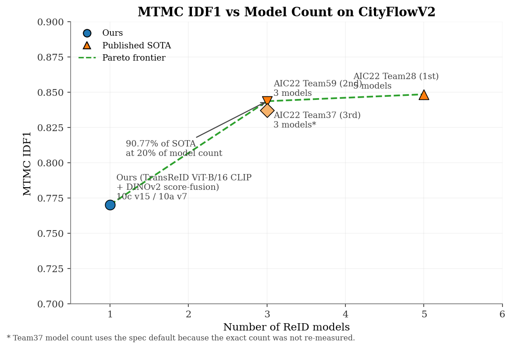 — CityFlowV2 Pareto view of MTMC IDF1 versus model count.
- 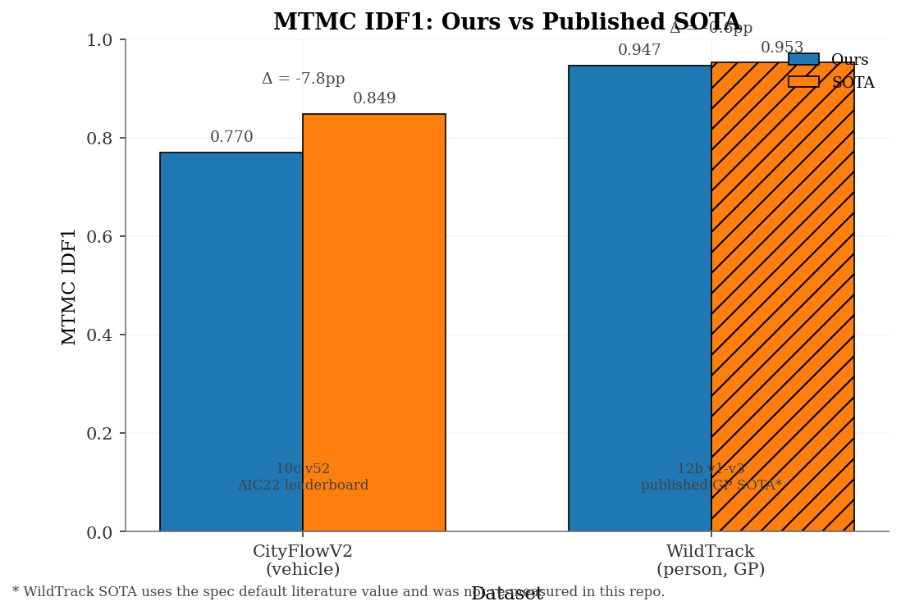 — Headline MTMC comparison for CityFlowV2 and WILDTRACK.
- 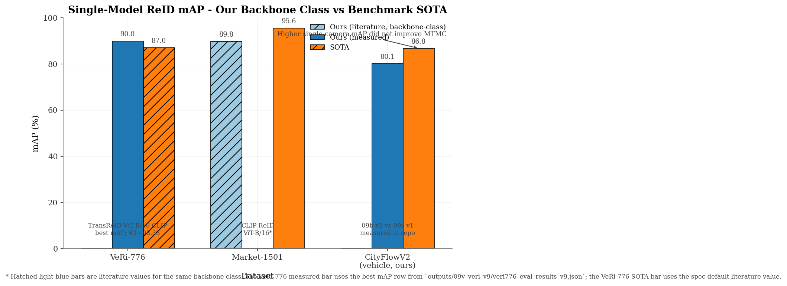 — Single-camera ReID benchmark view across VeRi-776, Market-1501, and CityFlowV2.
- 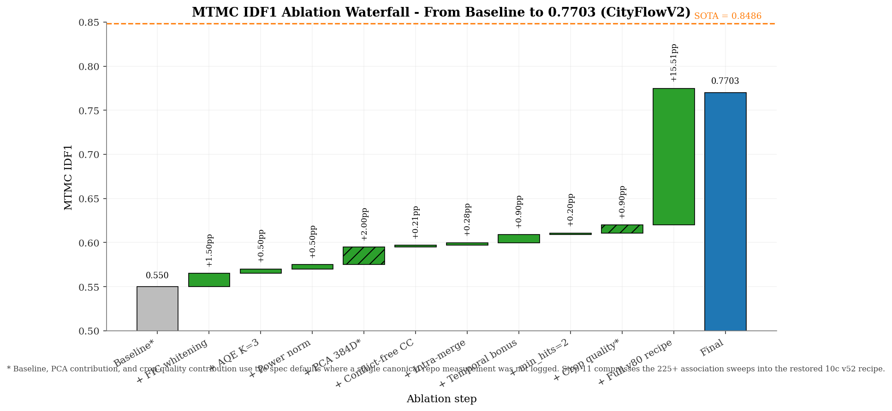 — Cumulative gains from the restored CityFlowV2 vehicle recipe.
- 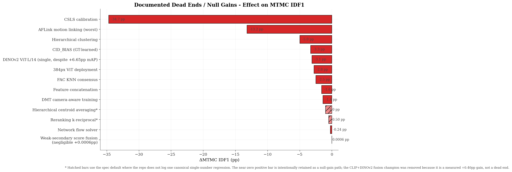 — Measured regressions from major dead ends.
- 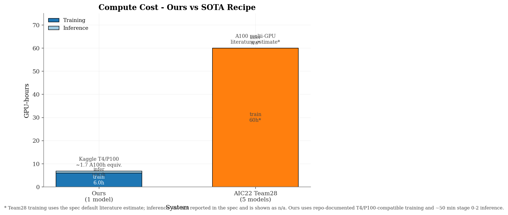 — Compute-efficiency contrast between our pipeline and a multi-model SOTA recipe.
- 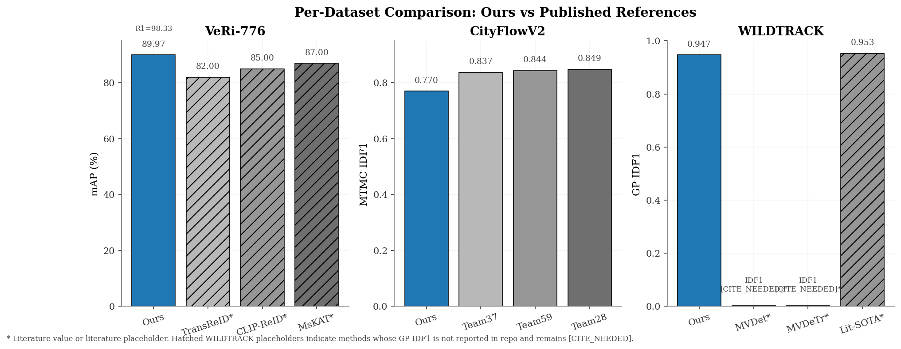 — Ours vs SOTA per dataset.
- 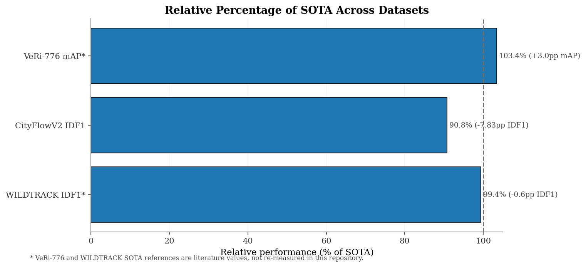 — Relative percentage of SOTA retained by our system on each benchmark.
- 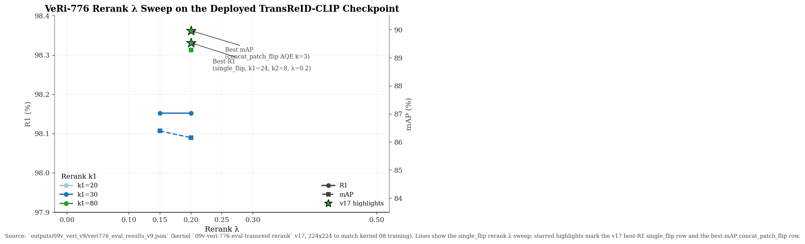 — VeRi-776 rerank λ sweep for the canonical v17 reproduction.
- 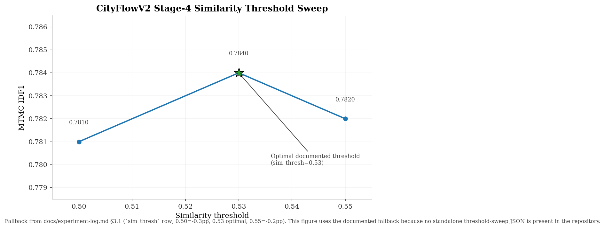 — Documented similarity-threshold sensitivity for Stage 4.
- 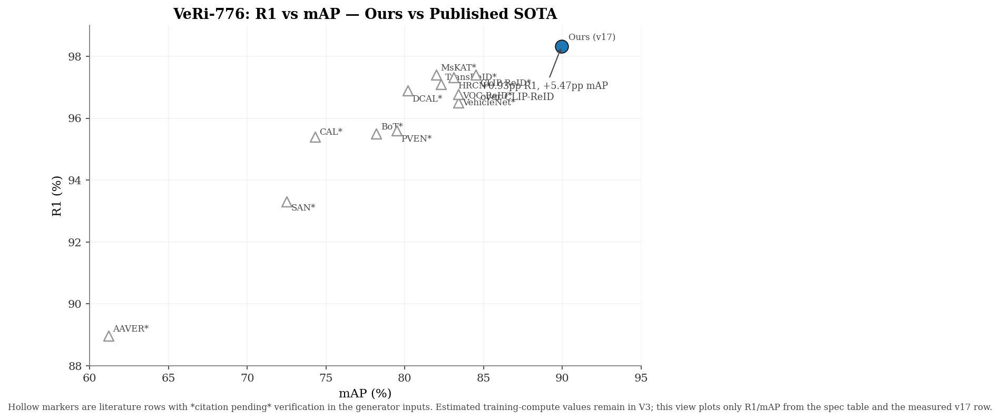 — VeRi-776 R1 vs mAP Pareto comparison, with pending literature rows rendered hollow.
- 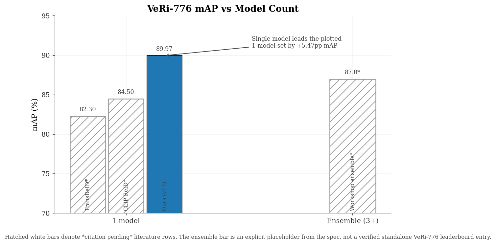 — VeRi-776 mAP versus model-count grouping.
- 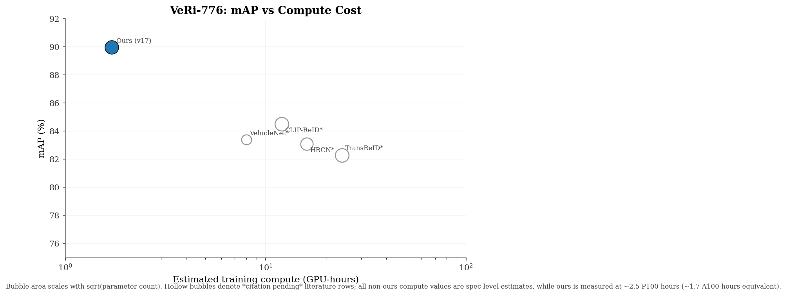 — VeRi-776 mAP versus estimated training compute, with bubble size scaling by parameter count.
- 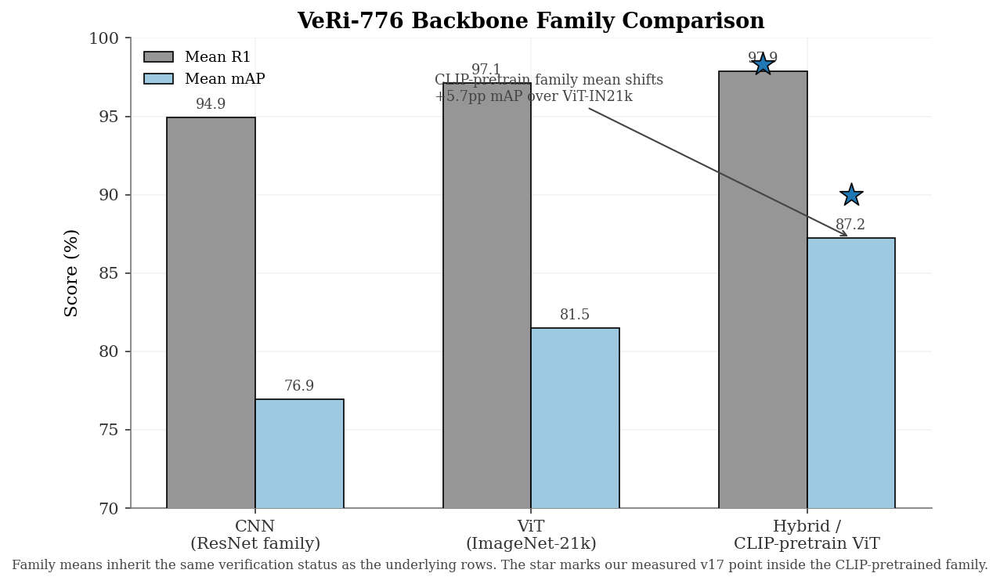 — Backbone-family means for CNN, ViT-IN21k, and CLIP-ViT groupings.
- 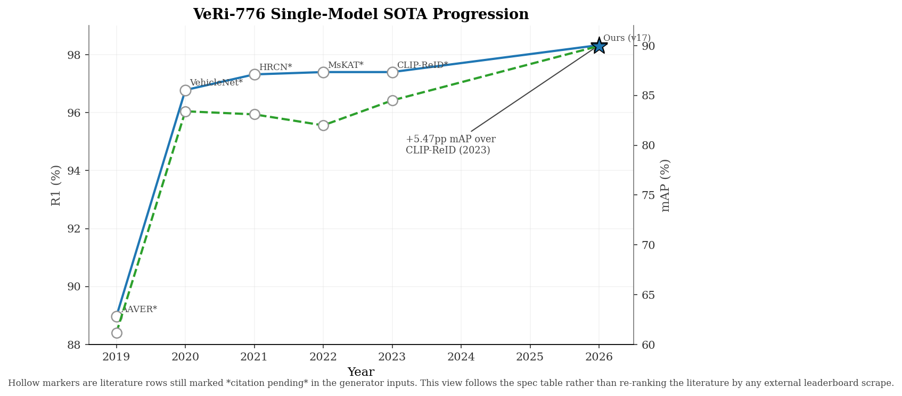 — Year-over-year single-model progression on VeRi-776.
- 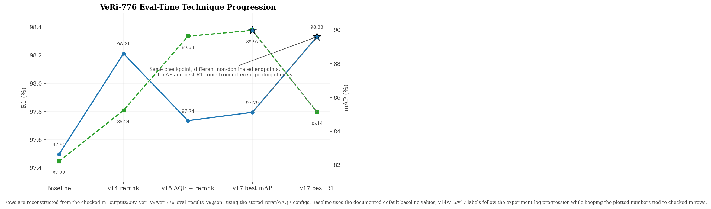 — Eval-time progression from baseline to the v17 frontier.
- 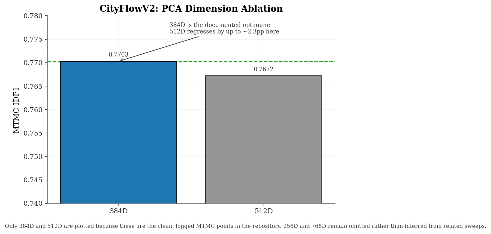 — Logged PCA-dimension ablation for the primary CityFlowV2 feature space.
- 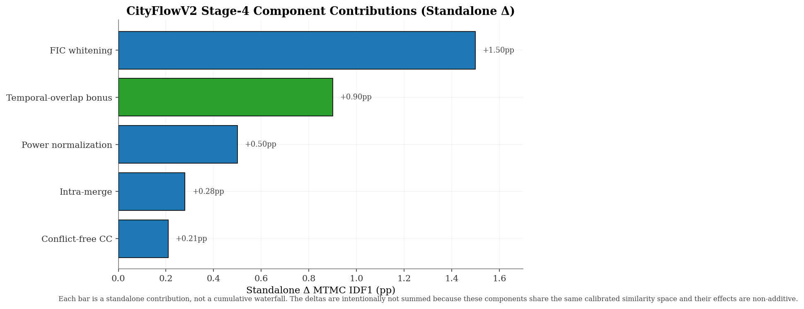 — Standalone Stage-4 component contributions, intentionally non-additive.
- 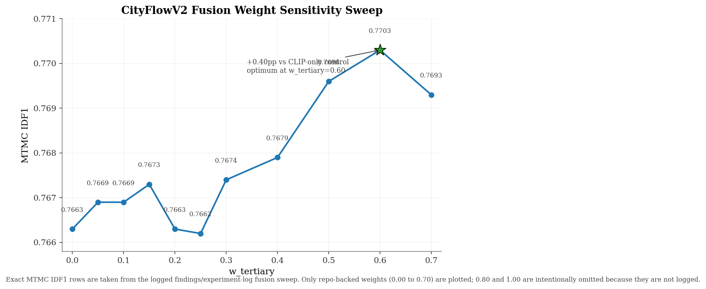 — Exact MTMC IDF1 sensitivity to the logged tertiary fusion weight sweep.
- 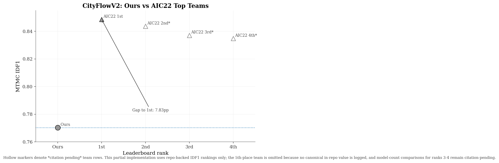 — Ours versus repo-backed AIC22 top-team rankings, with citation-pending teams rendered hollow.
- 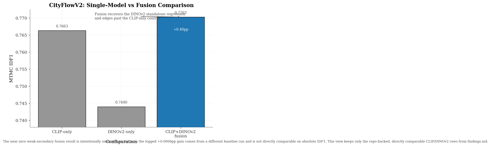 — Directly comparable CLIP-only, DINOv2-only, and CLIP+DINOv2 fusion MTMC IDF1.

## 5. What Worked

| Change | Magnitude | Source |
|---|---:|---|
| Conflict-free CC | **+0.21pp** | `.github/copilot-instructions.md`; `experiment-log.md` |
| Intra-merge (thresh=0.80, gap=30) | **+0.28pp** | same |
| Temporal overlap bonus | **+0.9pp** | `.github/copilot-instructions.md` |
| FIC whitening | **+1 to +2pp** | same |
| Power normalization | **+0.5pp** | same |
| AQE K=3 | small positive | `experiment-log.md` |
| min_hits=2 | **+0.2pp** | `.github/copilot-instructions.md` |
| Kalman tuning (person pipeline) | **+1.9pp IDF1** | same |
| Complementary score fusion (`w_tertiary=0.60`) | **+0.40pp** over single CLIP | `findings.md` |

## 6. Dead Ends

| Approach | Impact | Source |
|---|---:|---|
| CSLS | **−34.7pp** | `.github/copilot-instructions.md`; `findings.md` |
| AFLink motion linking | **−3.82pp** typical, **−13.2pp** worst | `.github/copilot-instructions.md` |
| 384px ViT deployment | **−2.8pp** | `findings.md` |
| FAC | **−2.5pp** | `.github/copilot-instructions.md` |
| Feature concatenation | **−1.6pp** | same |
| DMT camera-aware training | **−1.4pp** | same |
| CID_BIAS | **−1.0 to −3.3pp** | `findings.md`; `.github/copilot-instructions.md` |
| Hierarchical clustering | **−1 to −5pp** | `.github/copilot-instructions.md` |
| OSNet secondary (current weights) | **−0.8 to −1.1pp** | same |
| DINOv2 standalone (vs single CLIP control) | **−3.1pp** | `findings.md` |
| Network flow solver | **−0.24pp** | `.github/copilot-instructions.md`; `findings.md` |
| Reranking on the vehicle MTMC pipeline | always hurts | `.github/copilot-instructions.md` |

## 7. Conclusion

The comparison story is still the same after adding the extra graphs. VeRi-776 now has a clearer single-model SOTA context, but the repository-backed result remains the anchor. On CityFlowV2, the strongest factual claim is still the measured **0.7703** fusion result and the associated efficiency trade-off, not a narrative about any one auxiliary stream. The new figures therefore shift emphasis back to the primary **TransReID ViT-B/16 CLIP** backbone while leaving the measured fusion gain intact.

### Footnotes

- (*) Literature value, not re-measured in this repository.
- Hollow markers or hatched white bars mean *citation pending*.
